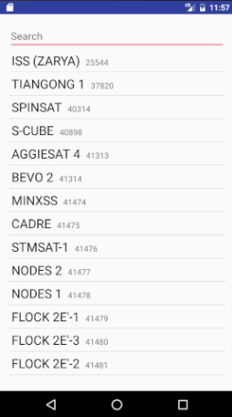

# Overview
This app allows the user to view the location of various satellites in real time.

# Demo
After the user selects a satellite from the list, the app will download its TLE from www.space-track.org/. Using the TLE it will calculate the LLA of the satellite  and display it on the map.

# Detail
## Activities
- **Select Satellite Activity**
	- mainActivity
	- Retrieve list of available satellites are stored on a local database
	- Allows the user to select a satellite (by name or NORAD id)
- **Satellite Map**
	- Shows the location of the given satellite

## Steps
- Present user with Select Satellite activity.
- When the user selects a satelite, look up the TLE for given satellite from https://www.space-track.org/#/tle asynchronously.
- Compute the the LLA from TLE using SGP.
	- Informatio on these equations can be found at http://www.stltracker.com/resources/equations.
- Intent to start Map activity at satellite location LLA.
- Have the map update the satellite location and projected orbit every 2 seconds.